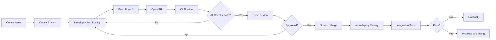
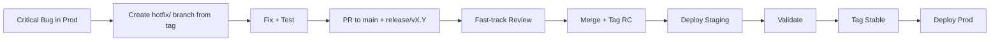

# Phase 25: Repository Architecture

## Overview

This phase defines the monorepo structure, module boundaries, shared libraries, build system, and development workflows for the RAG system. The architecture supports independent deployment of services while enabling code sharing and consistent tooling.

---

## 1. Monorepo Structure

```
rag-system/
├── .github/
│   ├── workflows/           # CI/CD workflows
│   ├── actions/             # Reusable composite actions
│   └── dependabot.yml       # Dependency updates
├── .vscode/                 # IDE settings
├── docs/                    # Documentation (MkDocs)
│   ├── architecture/        # Phase 1-26 docs
│   ├── api/                 # API reference
│   └── guides/              # How-to guides
├── tools/                   # Development tools
│   ├── codegen/             # Code generation (OpenAPI, GraphQL)
│   ├── migrate/             # Database migrations
│   ├── lint/                # Custom lint rules
│   └── release/             # Release automation
├── infra/                   # Infrastructure as Code
│   ├── terraform/           # AWS/GCP/Azure modules
│   ├── helm/                # Helm charts
│   │   ├── base/            # Base chart with common values
│   │   ├── services/        # Per-service charts
│   │   └── platform/        # Platform charts (monitoring, ingress)
│   ├── kustomize/           # Kustomize overlays
│   │   ├── base/
│   │   ├── dev/
│   │   ├── staging/
│   │   └── prod/
│   └── scripts/             # Infra utility scripts
├── libs/                    # Shared libraries (internal packages)
│   ├── python/
│   │   ├── rag-core/        # Core domain models, interfaces
│   │   ├── rag-config/      # Configuration management
│   │   ├── rag-observability/  # Logging, metrics, tracing
│   │   ├── rag-resilience/  # Circuit breakers, retries, fallbacks
│   │   ├── rag-security/    # Auth, RBAC, encryption
│   │   ├── rag-testing/     # Test utilities, fixtures, mocks
│   │   ├── rag-utils/       # Common utilities
│   │   └── rag-ml/          # ML utilities, model wrappers
│   ├── go/
│   │   ├── rag-infra/       # Infrastructure operators, controllers
│   │   ├── rag-cli/         # CLI tools
│   │   └── rag-gateway/     # Gateway plugins
│   └── typescript/
│       ├── rag-sdk/         # Client SDKs
│       ├── rag-ui-components/  # Shared React components
│       └── rag-api-client/  # Generated API client
├── services/                # Deployable services
│   ├── api-gateway/         # Kong/Envoy Gateway configuration
│   ├── query-processor/     # Main query pipeline
│   ├── classifier/          # Formulation classification
│   ├── retriever/           # Document retrieval
│   ├── generator/           # Answer generation
│   ├── knowledge-graph/     # KG query service
│   ├── jurisdiction/        # Jurisdiction resolution
│   ├── multilingual/        # Translation, language detection
│   ├── escalation/          # Human escalation queue
│   ├── memory/              # Conversation memory
│   ├── agent-orchestrator/  # Agentic workflow engine
│   ├── evaluation/          # Evaluation service
│   ├── admin-api/           # Admin operations
│   ├── webhook-processor/   # Inbound webhooks
│   └── document-ingestion/  # Document processing pipeline
├── workers/                 # Async workers
│   ├── embedding-worker/    # Batch embedding generation
│   ├── ingestion-worker/    # Document ingestion
│   ├── evaluation-worker/   # Batch evaluation
│   ├── cleanup-worker/      # TTL, garbage collection
│   └── sync-worker/         # Data synchronization
├── ml/                      # Machine Learning
│   ├── models/              # Model definitions, configs
│   ├── training/            # Training pipelines
│   ├── evaluation/          # Model evaluation
│   ├── serving/             # Model serving configs
│   └── experiments/         # Experiment tracking
├── data/                    # Data pipeline
│   ├── ingestion/           # Source connectors
│   ├── processing/          # Transformations
│   ├── quality/             # Data quality checks
│   └── catalog/             # Data catalog
├── frontend/                # Web applications
│   ├── admin-console/       # Admin dashboard
│   ├── developer-portal/    # API docs, playground
│   ├── playground/          # Query testing UI
│   └── shared/              # Shared frontend config
├── tests/                   # Cross-cutting tests
│   ├── integration/         # Integration tests
│   ├── e2e/                 # End-to-end tests (Playwright)
│   ├── contract/            # Contract tests (Pact)
│   ├── performance/         # Load tests (k6)
│   └── chaos/               # Chaos experiments
├── scripts/                 # Repository-level scripts
│   ├── bootstrap.sh         # Initial setup
│   ├── dev.sh               # Start dev environment
│   ├── test.sh              # Run all tests
│   └── release.sh           # Release automation
├── .tool-versions           # asdf/mise tool versions
├── pyproject.toml           # Python workspace config
├── Cargo.toml               # Rust workspace config
├── package.json             # Node workspace config
├── go.work                  # Go workspace config
├── Makefile                 # Common commands
├── docker-compose.yml       # Local development stack
├── README.md
├── CONTRIBUTING.md
├── CODEOWNERS
└── LICENSE
```

---

## 2. Module Boundaries & Dependency Rules

### 2.1 Dependency Graph

```
┌─────────────────────────────────────────────────────────────┐
│                      EXTERNAL DEPENDENCIES                   │
│  (FastAPI, Pydantic, LangChain, Qdrant, Neo4j, Redis, etc.) │
└─────────────────────────────────────────────────────────────┘
                              ▲
                              │
┌─────────────────────────────────────────────────────────────┐
│                      SHARED LIBRARIES (libs/)                │
│  rag-core → rag-config → rag-observability → rag-resilience │
│         ↘ rag-security → rag-testing → rag-utils            │
│         ↘ rag-ml                                            │
└─────────────────────────────────────────────────────────────┘
                              ▲
                              │
┌─────────────────────────────────────────────────────────────┐
│                      SERVICES (services/)                    │
│  Each service imports from libs/ only                       │
│  Services communicate via gRPC/REST/Kafka (no direct imports)│
└─────────────────────────────────────────────────────────────┘
```

### 2.2 Allowed Dependencies

| Consumer | Can Depend On |
|----------|---------------|
| `libs/*` | External deps only (no other libs, no services) |
| `services/*` | `libs/*`, external deps |
| `workers/*` | `libs/*`, `services/*` (via client), external deps |
| `ml/*` | `libs/rag-core`, `libs/rag-ml`, `libs/rag-utils`, external |
| `data/*` | `libs/rag-core`, `libs/rag-utils`, external |
| `frontend/*` | `libs/typescript/*`, external |
| `tests/*` | Everything (test-only) |

### 2.3 Enforcement

```python
# tools/lint/dependency_check.py
"""Enforce architectural dependency rules."""

import ast
import sys
from pathlib import Path
from typing import Set

FORBIDDEN_PATTERNS = [
    # Services cannot import other services directly
    ("services/", "services/"),
    # Libs cannot import services
    ("libs/", "services/"),
    # Libs cannot import other libs (except allowed)
    ("libs/rag-core", "libs/rag-ml"),  # core shouldn't know about ml
]

ALLOWED_LIB_DEPS = {
    "rag-core": set(),  # No internal deps
    "rag-config": {"rag-core"},
    "rag-observability": {"rag-core", "rag-config"},
    "rag-resilience": {"rag-core", "rag-config", "rag-observability"},
    "rag-security": {"rag-core", "rag-config"},
    "rag-testing": {"rag-core", "rag-config"},
    "rag-utils": {"rag-core"},
    "rag-ml": {"rag-core", "rag-config", "rag-utils"},
}

def check_imports(file_path: Path) -> list[str]:
    """Check a Python file for forbidden imports."""
    violations = []
    content = file_path.read_text()
    tree = ast.parse(content)
    
    for node in ast.walk(tree):
        if isinstance(node, ast.ImportFrom) and node.module:
            module = node.module
            # Check forbidden patterns
            for src_pattern, dst_pattern in FORBIDDEN_PATTERNS:
                if str(file_path).startswith(src_pattern) and module.startswith(dst_pattern.replace("/", ".")):
                    violations.append(f"{file_path}: imports {module} (forbidden: {src_pattern} → {dst_pattern})")
            
            # Check lib-to-lib dependencies
            for lib, allowed in ALLOWED_LIB_DEPS.items():
                if f"libs/{lib}" in str(file_path):
                    for name in node.names:
                        full_name = f"{module}.{name.name}" if module else name.name
                        for dep in full_name.split("."):
                            if dep.startswith("rag-") and dep not in allowed and dep != lib:
                                violations.append(f"{file_path}: {lib} imports {dep} (not in allowed: {allowed})")
    
    return violations
```

---

## 3. Shared Libraries Design

### 3.1 rag-core: Domain Models

```python
# libs/python/rag-core/rag_core/domain.py
"""Core domain models - zero dependencies."""

from dataclasses import dataclass, field
from datetime import datetime
from enum import Enum
from typing import Generic, TypeVar, Optional
from uuid import UUID, uuid4

T = TypeVar('T')

class QueryIntent(Enum):
    CLASSIFICATION = "classification"
    RETRIEVAL = "retrieval"
    GENERATION = "generation"
    EXPLANATION = "explanation"
    COMPARISON = "comparison"

class FormulationClass(Enum):
    AYURVEDA_CLASSICAL = "ayurveda_classical"
    AYURVEDA_PROPRIETARY = "ayurveda_proprietary"
    UNANI_CLASSICAL = "unani_classical"
    SIDDHA_CLASSICAL = "siddha_classical"
    HOMEOPATHY = "homeopathy"
    DRUG_SCHEDULE = "drug_schedule"
    COSMETIC = "cosmetic"
    NUTRACEUTICAL = "nutraceutical"
    PHYTOPHARMACEUTICAL = "phytopharmaceutical"
    AYURVEDA_AAHAR = "ayurveda_aahar"

class Language(Enum):
    EN = "en"
    HI = "hi"
    TA = "ta"
    BN = "bn"
    TE = "te"
    MR = "mr"
    GU = "gu"
    KN = "kn"
    ML = "ml"
    PA = "pa"
    OR = "or"
    AS = "as"
    UR = "ur"

@dataclass(frozen=True)
class Query:
    text: str
    language: Language = Language.EN
    intent: Optional[QueryIntent] = None
    user_id: Optional[str] = None
    session_id: Optional[str] = None
    request_id: str = field(default_factory=lambda: str(uuid4()))
    timestamp: datetime = field(default_factory=datetime.utcnow)
    metadata: dict = field(default_factory=dict)

@dataclass(frozen=True)
class Document:
    id: str
    content: str
    metadata: dict = field(default_factory=dict)
    score: float = 0.0
    source_authority: float = 1.0

@dataclass(frozen=True)
class Citation:
    document_id: str
    text: str
    start_char: int
    end_char: int
    confidence: float = 1.0

@dataclass(frozen=True)
class ClassificationResult:
    formulation_class: FormulationClass
    confidence: float
    method: str  # "rule", "llm", "hybrid"
    reasoning: str
    escalated: bool = False
    escalation_reason: Optional[str] = None
    jurisdiction: Optional[str] = None
    licensing_requirements: list[str] = field(default_factory=list)
    abs_requirements: list[str] = field(default_factory=list)
    labeling_requirements: list[str] = field(default_factory=list)

@dataclass(frozen=True)
class GenerationResult:
    answer: str
    citations: list[Citation]
    confidence: float
    tokens_used: int
    model: str
    latency_ms: int

@dataclass(frozen=True)
class QueryResponse:
    query: Query
    classification: ClassificationResult
    generation: GenerationResult
    retrieved_documents: list[Document]
    trace_id: str
    processing_time_ms: int
```

### 3.2 rag-config: Configuration Management

```python
# libs/python/rag-config/rag_config/__init__.py
"""Configuration management with validation."""

from pydantic_settings import BaseSettings, SettingsConfigDict
from pydantic import Field, validator
from typing import Optional
from functools import lru_cache

class Settings(BaseSettings):
    model_config = SettingsConfigDict(
        env_file=".env",
        env_file_encoding="utf-8",
        case_sensitive=False,
        extra="ignore"
    )
    
    # Service
    service_name: str = "rag-service"
    environment: str = "development"
    log_level: str = "INFO"
    
    # API
    api_host: str = "0.0.0.0"
    api_port: int = 8000
    api_workers: int = 4
    
    # Database
    database_url: str = Field(..., description="PostgreSQL connection string")
    database_pool_size: int = 10
    database_max_overflow: int = 20
    
    # Redis
    redis_url: str = "redis://localhost:6379/0"
    redis_max_connections: int = 50
    
    # Vector DB
    qdrant_url: str = "http://localhost:6333"
    qdrant_api_key: Optional[str] = None
    qdrant_collection: str = "documents"
    
    # Knowledge Graph
    neo4j_uri: str = "bolt://localhost:7687"
    neo4j_user: str = "neo4j"
    neo4j_password: str = Field(..., description="Neo4j password")
    neo4j_database: str = "neo4j"
    
    # Kafka
    kafka_bootstrap_servers: str = "localhost:9092"
    kafka_consumer_group: str = "rag-consumer"
    
    # LLM
    openai_api_key: Optional[str] = None
    anthropic_api_key: Optional[str] = None
    default_llm_model: str = "gpt-4o"
    fast_llm_model: str = "gpt-4o-mini"
    llm_temperature: float = 0.1
    llm_max_tokens: int = 4096
    
    # Embeddings
    embedding_model: str = "BAAI/bge-m3"
    embedding_batch_size: int = 32
    embedding_device: str = "cuda"
    
    # Classification
    classification_confidence_threshold: float = 0.6
    escalation_queue_max_size: int = 1000
    
    # Observability
    otlp_endpoint: Optional[str] = None
    metrics_port: int = 9090
    trace_sample_rate: float = 0.1
    
    # Security
    jwt_secret: str = Field(..., description="JWT signing secret")
    jwt_algorithm: str = "RS256"
    jwt_expiry_minutes: int = 60
    api_key_header: str = "X-API-Key"
    
    # Rate limiting
    rate_limit_requests: int = 100
    rate_limit_window_seconds: int = 60
    
    @validator("environment")
    def validate_env(cls, v):
        allowed = ["development", "staging", "production"]
        if v not in allowed:
            raise ValueError(f"environment must be one of {allowed}")
        return v

@lru_cache()
def get_settings() -> Settings:
    return Settings()
```

### 3.3 rag-observability: Unified Observability

```python
# libs/python/rag-observability/rag_observability/__init__.py
"""Unified observability library."""

from .logging import get_logger, ObservabilityLogger
from .metrics import MetricsCollector, get_metrics
from .tracing import TracingManager, get_tracer, trace_operation
from .health import HealthChecker, register_check

__all__ = [
    "get_logger",
    "ObservabilityLogger",
    "MetricsCollector",
    "get_metrics",
    "TracingManager",
    "get_tracer",
    "trace_operation",
    "HealthChecker",
    "register_check",
]

# Service initialization helper
def init_observability(service_name: str, version: str) -> tuple:
    """Initialize all observability components."""
    logger = get_logger(service_name, version)
    metrics = MetricsCollector(service_name)
    tracer = TracingManager(service_name, version)
    return logger, metrics, tracer
```

---

## 4. Build System

### 4.1 Python: Poetry + Pyproject.toml

```toml
# pyproject.toml (root)
[build-system]
requires = ["poetry-core>=1.8.0"]
build-backend = "poetry.core.masonry.api"

[tool.poetry]
name = "rag-system"
version = "0.1.0"
description = "Regulatory RAG System"
authors = ["RAG Team <rag@company.com>"]
readme = "README.md"
packages = []

[tool.poetry.workspace]
mode = "explicit"
members = [
    "libs/python/rag-core",
    "libs/python/rag-config",
    "libs/python/rag-observability",
    "libs/python/rag-resilience",
    "libs/python/rag-security",
    "libs/python/rag-testing",
    "libs/python/rag-utils",
    "libs/python/rag-ml",
    "services/query-processor",
    "services/classifier",
    "services/retriever",
    "services/generator",
    "services/knowledge-graph",
    "services/jurisdiction",
    "services/multilingual",
    "services/escalation",
    "services/memory",
    "services/agent-orchestrator",
    "services/evaluation",
    "services/admin-api",
    "services/webhook-processor",
    "services/document-ingestion",
    "workers/embedding-worker",
    "workers/ingestion-worker",
    "workers/evaluation-worker",
    "workers/cleanup-worker",
    "workers/sync-worker",
]

[tool.poetry.group.dev.dependencies]
ruff = "^0.3.0"
mypy = "^1.8.0"
pytest = "^8.0.0"
pytest-asyncio = "^0.23.0"
pytest-cov = "^5.0.0"
pytest-mock = "^3.12.0"
httpx = "^0.26.0"
faker = "^25.0.0"
pre-commit = "^3.6.0"

[tool.ruff]
target-version = "py311"
line-length = 100
select = ["E", "F", "I", "UP", "B", "C4", "SIM", "T20", "ARG", "PTH", "ERA", "PL", "TRY"]
ignore = ["S101", "TRY003", "ARG001", "ARG002"]
per-file-ignores = ["tests/*: S101,TRY003"]

[tool.ruff.format]
quote-style = "double"
indent-style = "space"
skip-magic-trailing-comma = false

[tool.mypy]
python_version = "3.11"
strict = true
warn_return_any = true
warn_unused_configs = true
disallow_untyped_defs = true
disallow_incomplete_defs = true
check_untyped_defs = true
no_implicit_optional = true
show_error_codes = true
pretty = true

[[tool.mypy.overrides]]
module = "tests.*"
strict = false
disallow_untyped_defs = false
```

### 4.2 Service Pyproject.toml Template

```toml
# services/query-processor/pyproject.toml
[build-system]
requires = ["poetry-core>=1.8.0"]
build-backend = "poetry.core.masonry.api"

[tool.poetry]
name = "rag-query-processor"
version = "0.1.0"
description = "Query Processing Service"
packages = [{include = "rag_query_processor", from = "src"}]

[tool.poetry.dependencies]
python = ">=3.11,<3.13"
rag-core = {path = "../../../libs/python/rag-core", develop = true}
rag-config = {path = "../../../libs/python/rag-config", develop = true}
rag-observability = {path = "../../../libs/python/rag-observability", develop = true}
rag-resilience = {path = "../../../libs/python/rag-resilience", develop = true}
rag-security = {path = "../../../libs/python/rag-security", develop = true}
fastapi = "^0.109.0"
uvicorn = "^0.27.0"
pydantic = "^2.6.0"
pydantic-settings = "^2.2.0"
httpx = "^0.26.0"
tenacity = "^8.2.0"

[tool.poetry.group.dev.dependencies]
pytest = "^8.0.0"
pytest-asyncio = "^0.23.0"
pytest-mock = "^3.12.0"
httpx = "^0.26.0"
```

### 4.3 Makefile: Common Commands

```makefile
# Makefile (root)
.PHONY: help install test lint typecheck format build docker-build deploy clean

# Default target
help:
	@echo "RAG System - Development Commands"
	@echo ""
	@echo "Setup:"
	@echo "  make install          Install all dependencies"
	@echo "  make bootstrap        Full bootstrap (deps + infra + db)"
	@echo ""
	@echo "Development:"
	@echo "  make dev              Start local development stack"
	@echo "  make dev-logs         Follow dev stack logs"
	@echo "  make dev-down         Stop dev stack"
	@echo ""
	@echo "Code Quality:"
	@echo "  make lint             Run ruff linter"
	@echo "  make format           Format with ruff"
	@echo "  make typecheck        Run mypy type checking"
	@echo "  make check            Run all quality checks"
	@echo ""
	@echo "Testing:"
	@echo "  make test             Run all tests"
	@echo "  make test-unit        Run unit tests only"
	@echo "  make test-integration Run integration tests"
	@echo "  make test-e2e         Run end-to-end tests"
	@echo "  make test-perf        Run performance tests"
	@echo ""
	@echo "Building:"
	@echo "  make build            Build all packages"
	@echo "  make docker-build     Build all Docker images"
	@echo ""
	@echo "Deployment:"
	@echo "  make deploy-dev       Deploy to dev"
	@echo "  make deploy-staging   Deploy to staging"
	@echo "  make deploy-prod      Deploy to production"
	@echo ""

# Install all dependencies
install:
	poetry install --with dev --all-extras
	cd frontend && npm ci

# Bootstrap development environment
bootstrap: install
	docker-compose up -d postgres redis qdrant neo4j kafka
	sleep 10
	poetry run alembic upgrade head
	poetry run python -m rag_core.init_db

# Start development stack
dev:
	docker-compose -f docker-compose.yml -f docker-compose.dev.yml up

# Code quality
lint:
	poetry run ruff check .

format:
	poetry run ruff format .

typecheck:
	poetry run mypy .

check: lint typecheck

# Testing
test:
	poetry run pytest -xvs --tb=short

test-unit:
	poetry run pytest tests/unit -xvs --tb=short

test-integration:
	poetry run pytest tests/integration -xvs --tb=short

test-e2e:
	cd frontend && npx playwright test

test-perf:
	k6 run tests/performance/load_test.js

# Building
build:
	poetry build --format=wheel

docker-build:
	docker buildx bake --push

# Deployment
deploy-dev:
	cd infra && ./deploy.sh dev

deploy-staging:
	cd infra && ./deploy.sh staging

deploy-prod:
	cd infra && ./deploy.sh prod

# Cleanup
clean:
	find . -type d -name "__pycache__" -exec rm -rf {} +
	find . -type d -name ".pytest_cache" -exec rm -rf {} +
	find . -type d -name ".mypy_cache" -exec rm -rf {} +
	find . -type d -name ".ruff_cache" -exec rm -rf {} +
	find . -type d -name "dist" -exec rm -rf {} +
	find . -type d -name "build" -exec rm -rf {} +
```

---

## 5. CI/CD Pipeline

### 5.1 GitHub Actions Workflow

```yaml
# .github/workflows/ci.yml
name: CI

on:
  push:
    branches: [main, develop]
  pull_request:
    branches: [main, develop]

env:
  POETRY_VERSION: 1.8.0
  PYTHON_VERSION: "3.11"
  NODE_VERSION: "20"

jobs:
  # Code Quality
  lint:
    name: Lint & Format
    runs-on: ubuntu-latest
    steps:
      - uses: actions/checkout@v4
      - uses: actions/setup-python@v5
        with:
          python-version: ${{ env.PYTHON_VERSION }}
      - name: Install Poetry
        run: pipx install poetry==${{ env.POETRY_VERSION }}
      - name: Install dependencies
        run: poetry install --with dev --all-extras
      - name: Run Ruff
        run: poetry run ruff check --output-format=github .
      - name: Check Format
        run: poetry run ruff format --check .
      - name: Run MyPy
        run: poetry run mypy .

  # TypeScript/Frontend
  frontend-lint:
    name: Frontend Lint
    runs-on: ubuntu-latest
    defaults:
      run:
        working-directory: ./frontend
    steps:
      - uses: actions/checkout@v4
      - uses: actions/setup-node@v4
        with:
          node-version: ${{ env.NODE_VERSION }}
          cache: 'npm'
      - run: npm ci
      - run: npm run lint
      - run: npm run typecheck

  # Unit Tests
  test-unit:
    name: Unit Tests
    runs-on: ubuntu-latest
    services:
      postgres:
        image: postgres:16
        env:
          POSTGRES_PASSWORD: postgres
          POSTGRES_DB: rag_test
        ports: [5432:5432]
        options: >-
          --health-cmd "pg_isready -U postgres"
          --health-interval 10s
          --health-timeout 5s
          --health-retries 5
      redis:
        image: redis:7
        ports: [6379:6379]
        options: --health-cmd "redis-cli ping" --health-interval 10s --health-timeout 5s --health-retries 5
    steps:
      - uses: actions/checkout@v4
      - uses: actions/setup-python@v5
        with:
          python-version: ${{ env.PYTHON_VERSION }}
      - name: Install Poetry
        run: pipx install poetry==${{ env.POETRY_VERSION }}
      - name: Install dependencies
        run: poetry install --with dev --all-extras
      - name: Run unit tests
        run: poetry run pytest tests/unit -xvs --tb=short --cov=libs --cov=services --cov-report=xml
      - name: Upload coverage
        uses: codecov/codecov-action@v4
        with:
          files: ./coverage.xml

  # Integration Tests
  test-integration:
    name: Integration Tests
    runs-on: ubuntu-latest
    needs: lint
    services:
      postgres:
        image: postgres:16
        env:
          POSTGRES_PASSWORD: postgres
          POSTGRES_DB: rag_test
        ports: [5432:5432]
      redis:
        image: redis:7
        ports: [6379:6379]
      qdrant:
        image: qdrant/qdrant:v1.7
        ports: [6333:6333]
      neo4j:
        image: neo4j:5
        env:
          NEO4J_AUTH: neo4j/password
        ports: [7687:7687, 7474:7474]
    steps:
      - uses: actions/checkout@v4
      - uses: actions/setup-python@v5
        with:
          python-version: ${{ env.PYTHON_VERSION }}
      - name: Install Poetry
        run: pipx install poetry==${{ env.POETRY_VERSION }}
      - name: Install dependencies
        run: poetry install --with dev --all-extras
      - name: Run migrations
        run: poetry run alembic upgrade head
      - name: Run integration tests
        run: poetry run pytest tests/integration -xvs --tb=short

  # Contract Tests
  test-contract:
    name: Contract Tests
    runs-on: ubuntu-latest
    needs: lint
    steps:
      - uses: actions/checkout@v4
      - uses: actions/setup-python@v5
        with:
          python-version: ${{ env.PYTHON_VERSION }}
      - name: Install Poetry
        run: pipx install poetry==${{ env.POETRY_VERSION }}
      - name: Install dependencies
        run: poetry install --with dev --all-extras
      - name: Run contract tests
        run: poetry run pytest tests/contract -xvs --tb=short

  # Docker Build
  docker-build:
    name: Build Docker Images
    runs-on: ubuntu-latest
    needs: [lint, test-unit, test-integration, test-contract]
    if: github.event_name == 'push'
    steps:
      - uses: actions/checkout@v4
      - name: Set up Docker Buildx
        uses: docker/setup-buildx-action@v3
      - name: Login to ECR
        uses: aws-actions/amazon-ecr-login@v2
      - name: Build and push
        run: |
          docker buildx bake --push \
            --set "*.tags=${{ env.REGISTRY }}/${{ github.repository }}:{{tag}}" \
            --set "*.labels=git.sha=${{ github.sha }}"

  # Deploy to Dev
  deploy-dev:
    name: Deploy to Dev
    runs-on: ubuntu-latest
    needs: docker-build
    if: github.ref == 'refs/heads/develop'
    environment: development
    steps:
      - uses: actions/checkout@v4
      - name: Deploy to dev
        run: |
          cd infra
          ./deploy.sh dev

  # Deploy to Staging
  deploy-staging:
    name: Deploy to Staging
    runs-on: ubuntu-latest
    needs: docker-build
    if: github.ref == 'refs/heads/main'
    environment: staging
    steps:
      - uses: actions/checkout@v4
      - name: Deploy to staging
        run: |
          cd infra
          ./deploy.sh staging

  # Deploy to Production (manual approval)
  deploy-prod:
    name: Deploy to Production
    runs-on: ubuntu-latest
    needs: deploy-staging
    environment: production
    steps:
      - uses: actions/checkout@v4
      - name: Deploy to production
        run: |
          cd infra
          ./deploy.sh prod
```

---

## 6. Local Development

### 6.1 Docker Compose for Local Stack

```yaml
# docker-compose.yml
version: '3.8'

services:
  postgres:
    image: postgres:16
    environment:
      POSTGRES_PASSWORD: postgres
      POSTGRES_DB: rag
    ports: ["5432:5432"]
    volumes:
      - postgres_data:/var/lib/postgresql/data
    healthcheck:
      test: ["CMD-SHELL", "pg_isready -U postgres"]
      interval: 5s
      timeout: 5s
      retries: 5

  redis:
    image: redis:7
    ports: ["6379:6379"]
    volumes:
      - redis_data:/data
    healthcheck:
      test: ["CMD", "redis-cli", "ping"]
      interval: 5s
      timeout: 3s
      retries: 5

  qdrant:
    image: qdrant/qdrant:v1.7
    ports: ["6333:6333", "6334:6334"]
    volumes:
      - qdrant_data:/qdrant/storage
    healthcheck:
      test: ["CMD", "curl", "-f", "http://localhost:6333/health"]
      interval: 10s
      timeout: 5s
      retries: 5

  neo4j:
    image: neo4j:5
    environment:
      NEO4J_AUTH: neo4j/password
      NEO4J_PLUGINS: '["apoc", "graph-data-science"]'
    ports: ["7687:7687", "7474:7474"]
    volumes:
      - neo4j_data:/data
      - neo4j_logs:/logs
    healthcheck:
      test: ["CMD", "cypher-shell", "-u", "neo4j", "-p", "password", "RETURN 1"]
      interval: 10s
      timeout: 10s
      retries: 5

  kafka:
    image: confluentinc/cp-kafka:7.5.0
    environment:
      KAFKA_BROKER_ID: 1
      KAFKA_ZOOKEEPER_CONNECT: zookeeper:2181
      KAFKA_ADVERTISED_LISTENERS: PLAINTEXT://kafka:9092
      KAFKA_OFFSETS_TOPIC_REPLICATION_FACTOR: 1
    ports: ["9092:9092"]
    depends_on: [zookeeper]
    healthcheck:
      test: ["CMD-SHELL", "kafka-topics --bootstrap-server localhost:9092 --list"]
      interval: 10s
      timeout: 10s
      retries: 5

  zookeeper:
    image: confluentinc/cp-zookeeper:7.5.0
    environment:
      ZOOKEEPER_CLIENT_PORT: 2181
      ZOOKEEPER_TICK_TIME: 2000

  # Observability
  victoria-metrics:
    image: victoriametrics/victoria-metrics:v1.93
    command:
      - '--storageDataPath=/victoria-metrics-data'
      - '--retentionPeriod=30d'
    ports: ["8428:8428"]
    volumes:
      - vm_data:/victoria-metrics-data

  grafana:
    image: grafana/grafana:10.2
    environment:
      GF_SECURITY_ADMIN_PASSWORD: admin
      GF_USERS_ALLOW_SIGN_UP: "false"
    ports: ["3000:3000"]
    volumes:
      - grafana_data:/var/lib/grafana
      - ./infra/grafana/provisioning:/etc/grafana/provisioning
    depends_on: [victoria-metrics]

  tempo:
    image: grafana/tempo:2.4
    command:
      - '-config.file=/etc/tempo.yaml'
    ports: ["3200:3200", "4317:4317", "4318:4318"]
    volumes:
      - ./infra/tempo.yaml:/etc/tempo.yaml
      - tempo_data:/var/tempo

volumes:
  postgres_data:
  redis_data:
  qdrant_data:
  neo4j_data:
  neo4j_logs:
  vm_data:
  grafana_data:
  tempo_data:
```

### 6.2 Development Script

```bash
#!/bin/bash
# scripts/dev.sh

set -euo pipefail

echo "🚀 Starting RAG development environment..."

# Check dependencies
command -v docker >/dev/null 2>&1 || { echo "Docker not installed"; exit 1; }
command -v poetry >/dev/null 2>&1 || { echo "Poetry not installed"; exit 1; }

# Start infrastructure
echo "📦 Starting infrastructure..."
docker-compose up -d

# Wait for services
echo "⏳ Waiting for services to be healthy..."
timeout 120 bash -c 'until docker-compose ps | grep -q "healthy"; do sleep 2; done'

# Run migrations
echo "🗄️ Running database migrations..."
poetry run alembic upgrade head

# Install pre-commit hooks
echo "🔧 Installing pre-commit hooks..."
poetry run pre-commit install

echo "✅ Development environment ready!"
echo ""
echo "Services:"
echo "  - PostgreSQL: localhost:5432"
echo "  - Redis: localhost:6379"
echo "  - Qdrant: localhost:6333"
echo "  - Neo4j: localhost:7687 (browser: localhost:7474)"
echo "  - Kafka: localhost:9092"
echo "  - Grafana: localhost:3000 (admin/admin)"
echo "  - VictoriaMetrics: localhost:8428"
echo "  - Tempo: localhost:3200"
echo ""
echo "To run a service:"
echo "  poetry run uvicorn rag_query_processor.main:app --reload --port 8000"
echo ""
echo "To run tests:"
echo "  make test"
```

---

## 7. Release Management

### 7.1 Versioning Strategy

```markdown
## Versioning: SemVer with Release Channels

### Format: MAJOR.MINOR.PATCH[-CHANNEL.BUILD]

| Channel | Pattern | Example | Purpose |
|---------|---------|---------|---------|
| **Canary** | `0.0.0-canary.<sha>` | `0.0.0-canary.a1b2c3d` | Every commit to main |
| **Beta** | `X.Y.0-beta.N` | `1.2.0-beta.3` | Pre-release testing |
| **RC** | `X.Y.0-rc.N` | `1.2.0-rc.1` | Release candidate |
| **Stable** | `X.Y.Z` | `1.2.0` | Production release |

### Release Process

1. **Main branch** → Canary (automatic)
2. **Release branch** `release/v1.2` → Beta (weekly)
3. **RC tag** `v1.2.0-rc.1` → RC (manual)
4. **Stable tag** `v1.2.0` → Stable (manual, after RC validation)

### Changelog Generation

Automated from conventional commits:
- `feat:` → Features
- `fix:` → Bug Fixes
- `perf:` → Performance
- `docs:` → Documentation
- `refactor:` → Refactoring
- `BREAKING CHANGE:` → Breaking Changes
```

### 7.2 Release Automation

```python
# tools/release/release.py
"""Automated release management."""

import subprocess
import re
from pathlib import Path
from dataclasses import dataclass
from enum import Enum

class ReleaseChannel(Enum):
    CANARY = "canary"
    BETA = "beta"
    RC = "rc"
    STABLE = "stable"

@dataclass
class ReleaseConfig:
    channel: ReleaseChannel
    version: str
    dry_run: bool = False

def get_next_version(current: str, channel: ReleaseChannel) -> str:
    """Calculate next version based on channel."""
    # Parse current version
    match = re.match(r"(\d+)\.(\d+)\.(\d+)(?:-(.+))?", current)
    if not match:
        raise ValueError(f"Invalid version: {current}")
    
    major, minor, patch, prerelease = match.groups()
    major, minor, patch = int(major), int(minor), int(patch)
    
    if channel == ReleaseChannel.STABLE:
        if prerelease and prerelease.startswith("rc"):
            # RC -> Stable
            return f"{major}.{minor}.{patch}"
        elif prerelease and prerelease.startswith("beta"):
            # Beta -> RC
            rc_num = int(prerelease.split(".")[-1]) if "." in prerelease else 1
            return f"{major}.{minor}.{patch}-rc.{rc_num}"
        else:
            # Patch bump
            return f"{major}.{minor}.{patch+1}"
    
    elif channel == ReleaseChannel.RC:
        if prerelease and prerelease.startswith("beta"):
            beta_num = int(prerelease.split(".")[-1])
            return f"{major}.{minor}.{patch}-rc.{beta_num}"
        else:
            return f"{major}.{minor+1}.0-rc.1"
    
    elif channel == ReleaseChannel.BETA:
        return f"{major}.{minor+1}.0-beta.1"
    
    elif channel == ReleaseChannel.CANARY:
        import git
        repo = git.Repo(".")
        sha = repo.head.object.hexsha[:7]
        return f"{major}.{minor}.{patch+1}-canary.{sha}"

def create_release(config: ReleaseConfig):
    """Create a release."""
    # 1. Update version in pyproject.toml files
    # 2. Generate changelog
    # 3. Create git tag
    # 4. Build and push Docker images
    # 5. Create GitHub release
    # 6. Deploy to target environment
    pass
```

---

## 8. Code Ownership

### 8.1 CODEOWNERS

```text
# CODEOWNERS

# Global owners
* @rag-core-team

# Architecture
/docs/architecture/ @rag-architects

# Infrastructure
/infra/ @rag-platform-team
/.github/workflows/ @rag-platform-team

# Shared Libraries
/libs/python/rag-core/ @rag-core-team @rag-ml-team
/libs/python/rag-config/ @rag-platform-team
/libs/python/rag-observability/ @rag-platform-team
/libs/python/rag-resilience/ @rag-core-team
/libs/python/rag-security/ @rag-security-team
/libs/python/rag-ml/ @rag-ml-team

# Services
/services/query-processor/ @rag-core-team
/services/classifier/ @rag-classification-team
/services/retriever/ @rag-retrieval-team
/services/generator/ @rag-generation-team
/services/knowledge-graph/ @rag-kg-team
/services/jurisdiction/ @rag-classification-team
/services/multilingual/ @rag-ml-team
/services/escalation/ @rag-core-team
/services/memory/ @rag-core-team
/services/agent-orchestrator/ @rag-agents-team
/services/evaluation/ @rag-core-team

# Frontend
/frontend/ @rag-frontend-team

# ML
/ml/ @rag-ml-team

# Data
/data/ @rag-data-team

# Tests
/tests/ @rag-qa-team
```

---

## 9. Development Workflows

### 9.1 Feature Development Flow



### 9.2 Hotfix Flow



---

## 10. Open Research Questions

| ID | Question | Context |
|----|----------|---------|
| ORQ-69 | Should we use Nx/Turborepo for build orchestration? | Current Makefile + Poetry works but could be faster |
| ORQ-70 | How to handle shared library versioning across services? | Current `develop = true` works for monorepo but not for publishing |
| ORQ-71 | Should we extract frontend to separate repo? | Coupling vs independence trade-off |
| ORQ-72 | How to manage database migrations across services? | Each service owns its schema, but shared tables exist |
| ORQ-73 | Should we adopt Bazel for hermetic builds? | Scale vs complexity |

---

## 11. Summary

Phase 25 defines the repository architecture with:

1. **Monorepo Structure** organized by `libs/`, `services/`, `workers/`, `ml/`, `data/`, `frontend/`, `infra/`
2. **Strict Dependency Rules** enforced by automated linting
3. **Shared Libraries** (`rag-core`, `rag-config`, `rag-observability`, etc.) with clear boundaries
4. **Build System** using Poetry (Python), npm workspaces (TypeScript), Go workspaces, Cargo (Rust)
5. **CI/CD Pipeline** with lint, typecheck, unit, integration, contract, and performance tests
6. **Local Development** via Docker Compose with full stack
7. **Release Management** with semantic versioning and release channels
8. **Code Ownership** via CODEOWNERS for review routing
9. **Development Workflows** for features and hotfixes
10. **5 Open Research Questions** for build system evolution

This structure enables 15+ services to be developed, tested, and deployed independently while sharing core infrastructure.